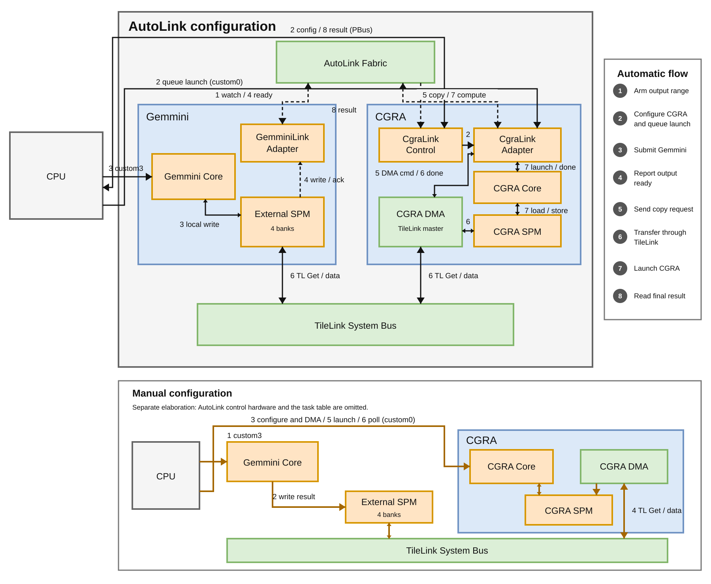

# AutoLink architecture

AutoLink adds automatic accelerator sequencing to the existing TileLink data path. It does not carry payload data and does not add a shared staging buffer. The current instance moves one 128-byte result from Gemmini's external SPM into CGRA local memory, then starts the configured CGRA kernel.



## Current scope

- `CGRAMinimalGemminiAutoLinkRocketConfig` instantiates AutoLink, one Gemmini endpoint, one CGRA endpoint, and one Gemmini to CGRA task.
- `CGRAMinimalGemminiRocketConfig` uses the same Gemmini external SPM but omits AutoLink, its task table, adapters, and control registers.
- `AutoLinkExample` fixes the task table during elaboration. The current task copies 128 bytes from the end of Gemmini's external SPM to CGRA SPM word 0.
- The CPU configures the CGRA launch packet count through MMIO, queues launch packets through `custom0`, and submits Gemmini work through `custom3`.
- After the CPU submits the work, hardware detects the Gemmini publication, moves the data, starts the CGRA, and returns the CGRA completion result.
- Runtime programming of routes, offsets, and transfer lengths is not supported in this phase.

## Control and data paths

AutoLink is the control path. `AutoLinkFabric` owns the task table, dependency state, descriptor arbitration, and compute joins. Its depth-2 copy queue stores `AutoCopyRequest` descriptors. It never stores payload data and therefore has no TileLink connection.

The task table fixes each source endpoint, destination endpoint, source offset, destination offset, and transfer length during elaboration. After a producer reports ready, `AutoLinkFabric` uses that table to send an `AutoCopyRequest` directly to the selected destination adapter. The request contains the source physical address and destination-local offset. The destination adapter then starts its DMA. TileLink performs the payload routing independently: the CGRA DMA issues a `Get`, and the system bus decodes the source address and routes it to the Gemmini external SPM manager.

Each task has its own FSM and uses ready/valid channels. Ready tasks can enqueue descriptors while a destination is handling earlier work, up to the descriptor queue capacity. A producer publication waits until all tasks that consume that publication are ready. The current CGRA endpoint still executes one DMA and compute sequence at a time.

TileLink is the data path. The CGRA DMA is the TileLink master for the current transfer. It reads Gemmini's external SPM through the system bus and writes each response into CGRA local SPM through the existing CGRA DMA interface.

Gemmini's external SPM contains four independent 16 KiB banks, for 64 KiB total. Each bank has separate Gemmini read and write TileLink managers. System-side masters have a read connection through the system bus. Same-bank memory logic prevents a read from observing a conflicting write; different banks can operate independently. Manual and automatic configurations instantiate this same storage attachment.

There are no output slots and no payload FIFO. `copyDepth = 2` buffers at most two copy descriptors; it does not provide double-buffered data storage. The current publication address comes from the task's source offset.

## Endpoint contract

An endpoint is the AutoLink control boundary for one accelerator instance. It is not a memory, address range, or payload port. The IP adapter converts the common endpoint messages into that accelerator's local control signals.

The producer receives `watchOutput` and returns `reportOutput`. After a successful report, the fabric sends `requestCopy` to the destination. The request contains the global TileLink source address, destination-local byte offset, transfer length, and task ID. It has no destination physical address because the destination adapter owns its local memory mapping. The current CGRA adapter converts the local byte offset into a CGRA SPM word address and uses DMA tag 0 to match completion.

The producer never pushes payload data. The CGRA consumer pulls the data after the fabric receives the producer's output report. `requestCompute` is sent only after all required copies report completion. If any source or copy fails, `AutoJoin` skips the compute launch and forwards the failure to the result path.

## Automatic sequence

1. `AutoLinkFabric` arms the Gemmini endpoint for the configured output range.
2. The CPU configures `CgraLinkControl` and queues the CGRA launch packets through `custom0`.
3. The CPU submits the Gemmini work through `custom3`.
4. `GemminiLinkMonitor` observes the external-SPM writes and acknowledgements. `GemminiLinkAdapter` reports ready after the full range has been written.
5. `AutoCopyTask` sends the source address, destination offset, and length to the CGRA endpoint.
6. `CgraLinkAdapter` starts the CGRA DMA. The DMA reads the Gemmini SPM through TileLink, fills CGRA SPM, and reports completion.
7. `AutoJoin` releases the saved launch packets after all required copies complete. The CGRA executes and reports `CMD_COMPLETE`.
8. The result passes through `AutoLinkFabric` and `CgraLinkControl` to the CPU.

The CGRA tile configuration packets still use the normal fast API and RoCC path. `CgraLinkAdapter` stores only the launch packets needed after the DMA completes. Its configuration FSM can collect packets while the execution FSM is idle, but the current adapter holds one kernel configuration and runs one copy and compute sequence at a time.

## Module boundaries

| Module | Responsibility |
| --- | --- |
| `AutoLink` | Defines reusable endpoint, event, copy, and compute messages. |
| `AutoLinkFabric` | Owns the static task table, routes control messages, queues descriptors, joins dependencies, and sequences compute requests. |
| `GemminiLinkAdapter` | Detects completion of a watched Gemmini external SPM write range. It does not move payload data. |
| `GemminiExternalSpm` | Implements the four-bank Gemmini backing memory and its TileLink managers. |
| `GemminiExternalSpmAttach` | Connects Gemmini local ports and system-bus readers to the common external SPM. |
| `GemminiExternalSpmWriter` | Connects Gemmini's publication writer directly in the Manual configuration. Auto uses `GemminiLinkMonitor` on the same path instead. |
| `CgraLinkAdapter` | Accepts copy and compute requests, drives the existing CGRA DMA, stores launch packets, and reports completion. |
| `CgraLinkControl` | Exposes packet-count configuration and final results through MMIO. Launch packet contents still use RoCC. |
| `CGRATileLinkDmaAdapter` | Converts the generated CGRA DMA memory interface into TileLink requests and responses. |
| `AutoLinkExample` | Describes the current endpoints, physical route, task, offsets, transfer size, and descriptor queue depth. It contains configuration only. |

## Configuration ownership

| Source | Values |
| --- | --- |
| `configs/soc/cgra_gemmini_soc.yaml` | CGRA memory settings, Gemmini external SPM base and total size, and the physical AutoLink source and destination pairs. |
| Gemmini elaboration parameters | SPM bank count and row geometry. The current Gemmini configuration has four banks. |
| `AutoLinkExample` | Endpoints, copy offsets, copy length, and descriptor queue depth for the current test instance. |
| `generate_cgra_link_control.py` | MMIO register layout. The control page begins immediately after the configured Gemmini external SPM region. |
| `relu_spm_auto.c` | Automatic External-SPM test. The CPU configures both IPs, submits Gemmini, then waits only for the final result. |
| `relu_spm_manual.c` | Manual External-SPM test. The CPU waits for Gemmini, explicitly starts the CGRA DMA, launches the CGRA, and polls completion. |
| `relu_dma.c` | Existing Manual DRAM test. Gemmini first writes DRAM, then the CPU starts the CGRA DMA from that DRAM address. |

## Manual configuration

`CGRAMinimalGemminiRocketConfig` instantiates the common External SPM but does not instantiate AutoLink, its task table, adapters, or control registers. There is no runtime mode bit. The selected Chipyard configuration determines whether the automatic control hardware exists.

1. The CPU runs Gemmini through `custom3`; Gemmini writes the result into the External SPM.
2. The CPU uses `gemmini_fence()` to wait for the publication writes to finish.
3. The CPU configures the CGRA and explicitly starts and waits for the CGRA DMA through `custom0`.
4. The CGRA DMA reads the External SPM through TileLink and fills CGRA SPM.
5. The CPU launches the CGRA through `custom0`.
6. The CPU waits for completion and reads the result.

The existing `relu_dma.c` path remains available when DRAM staging is desired. It uses the same Manual configuration but asks Gemmini to write DRAM instead of the External SPM.

## Deferred work

The current task table is fixed in Scala. Runtime loading of routes, offsets, lengths, and kernel instances is deferred to a follow-up task. The current adapters also cover only Gemmini as a producer and CGRA as a consumer. Reverse transfers and other accelerators require adapters for the same `AutoEndpointIO` contract. System-side writes into the External SPM are not exposed in this phase; the system-bus attachment is read-only. Each producer currently supports one distinct publication range.

The end-to-end test covers one 128-byte chunk. It does not validate multiple chunks, multiple kernels, or concurrent producers.

## Validation

Run the automatic path with:

```shell
$ ./run-chipyard-cgra-gemmini-demo.sh --rebuild
```

Run the Manual External-SPM path with:

```shell
$ CONFIG=CGRAMinimalGemminiRocketConfig ./run-chipyard-cgra-gemmini-demo.sh --rebuild tests/cgra-gemmini/relu_spm_manual.c
```
